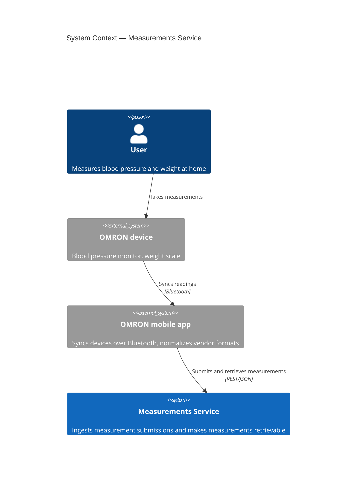
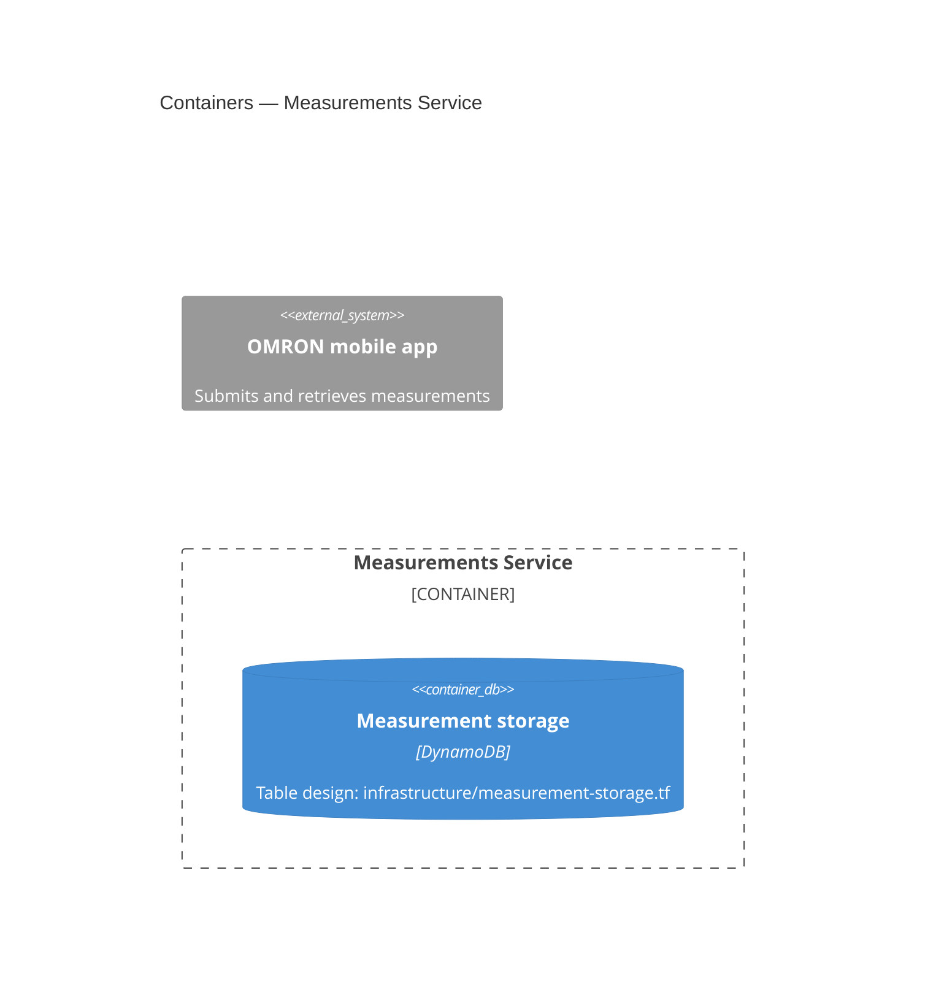

# Measurements Service — Candidate Submission

See [ASSIGNMENT.md](ASSIGNMENT.md) for the assignment. Structure your answers below.

## How to run

```bash
npm install
npm test
npm run lint
npm run build
```

Your implementation lives in the `services/measurements` workspace (`src/core/` for
domain logic, `src/entry/` for your compute adapter); tests go in `test/`.

## 1. Architectural overview

### System context



### Containers



### Deployment

```mermaid
C4Deployment
  title Measurements Service
```

### Rationale

_Why this architecture: your compute choice, and the trade-offs you weighed._

## 2. Data structure and flow

_Your data model and flow description here._

## 3. Implementation in TypeScript

_Notes on your implementation: what you built, how to exercise it, what you left out._

## 4. What could another team leverage from this setup?

_Your answer here._

## Before production

_What would you add before this handles real production traffic, and why?_

## AI usage and verification

_How did you use AI tools, and how did you verify their output?_
